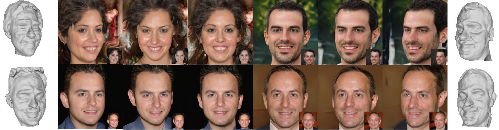

# SDFace-GAN: Lightweight 3D-Aware Generative Adversarial Network for Facial Image and Geometry Synthesis



## Environment

First you have to make sure that you have all dependencies in place. The simplest way to do so, is to use [anaconda](https://www.anaconda.com/).

You can create an anaconda environment called `sdface-gan` using
```
conda create --name sdface-gan python=3.8
pip install torch==1.9.0+cu102 torchvision==0.10.0+cu102 torchaudio==0.9.0 -f https://download.pytorch.org/whl/torch_stable.html
pip install kornia==0.5.11 ninja scikit-image munch configargparse pyyaml tqdm trimesh lmdb
conda install -c fvcore -c iopath -c conda-forge fvcore iopath plyfile
```

Then install [pytorch3d 0.6.1](https://github.com/facebookresearch/pytorch3d)
## Usage

### Datasets

The data that support the findings of this study are openly available at [FFHQ](https://github.com/NVlabs/ffhq-dataset) and [CelebaHq](https://github.com/tkarras/progressive_growing_of_gans). Please place them under `./data/` for training.


### Training

For training of the models, we provide the script `train.py`. You can run it using

```
python train.py --config configs/256res/ffhq_256_sdf_ngp.yaml --sdf 1 --ngp 1 --fc 0 --wod 0
```

The results of the operation will be saved in `./out/ffhq256_sdf_ngp/ `. 
We have prepared a [pretrained model](https://drive.google.com/file/d/1HkevHMk0lVnSLJ5rKlDJjJ90DIQ2PVdO/view?usp=drive_link) for direct using. Please place it under `./out/ffhq256_sdf_ngp/full_pipeline.pt`.

### Multi-view images and 3D mesh generation

To render images and 3D mesh, run
```
python sdf_mesh.py --config configs/256res/ffhq_256_sdf_ngp.yaml  --sdf 1 --ngp 1 --fc 0 --wod 0
```
The results of the operation will be saved in `./out/ffhq256_sdf_ngp/rendering/ `.

### Evaluating

For evaluation of the models, we provide the script `eval.py`. You can run it using

```
python eval.py --config configs/256res/ffhq_256_sdf_ngp.yaml --sdf 1 --ngp 1 --fc 0 --wod 0
fidelity --gpu 0 --fid --kid --input1 ./out/ffhq256_sdf_ngp/eval/ --input2 ffhq_data_path/
```

The script generates 5000 images and calculates the FID score and KID score.
